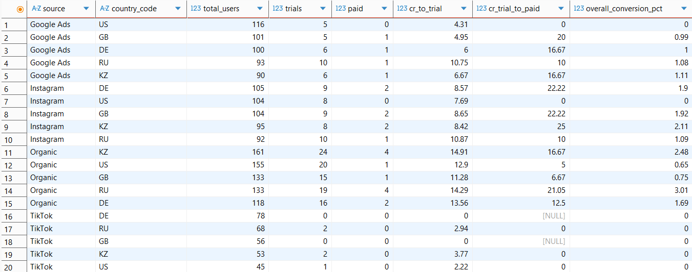
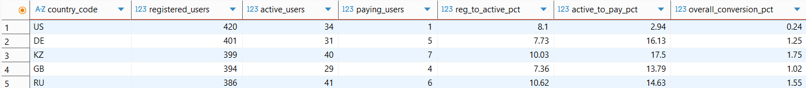

# FitLife Analytics — End‑to‑End Data Analytics Case Study
### SQL • Python • Cohorts • Unit Economics • A/B Testing
This case study analyzes FitLife’s funnel performance, retention behavior, unit economics, and A/B test results to identify growth bottlenecks and quantify the impact of a redesigned Paywall.

## Project Overview
FitLife is a subscription‑based fitness app offering a **7‑day trial** followed by a **$9.99 monthly plan**.
The analysis focuses on:

- End-to-end funnel conversion by acquisition channel
- Weekly and monthly retention patterns
- LTV, CAC efficiency, and ROMI
- A/B test of a redesigned Paywall
- Business impact and strategic recommendations

The dataset is synthetic for SQL logic but scaled to FitLife’s real annual traffic of **1,200,000 users**.

## Key Deliverables & Interactive Artifacts

- **Interactive Tableau Dashboard:** [FitLife Product Analytics on Tableau Public](https://public.tableau.com/app/profile/oleksandr.nikishyn/viz/FitLifeProductAnalytics/Dashboard1)
- **Executive Presentation (PDF):** [FitLife Analytics Presentation (PDF)](presentation/FitLife%20Analytics%20Presentation.pdf)
- **SQL Analytical Scripts:** [PostgreSQL Queries](sql/)
- **Python Analytics & Modeling:** [Jupyter Notebooks](python/)

## Tools & Metrics
- **SQL (PostgreSQL)** — funnel analysis, weekly retention, monthly cohorts
- **Python (Pandas, Seaborn, Statsmodels)** — cohort visualization, statistical testing

### Key Funnel Metrics Definitions

* **UA (User Acquisition):** Total volume of incoming traffic/downloads.
* **Trial Activation Rate ($\text{CR}_{\text{trial}}$):** Percentage of acquired users who activate a 7-day free trial.
* **Trial-to-Paid Conversion ($\text{CR}_{\text{trial}\to\text{paid}}$):** Percentage of trial users who complete their first subscription payment (Paywall efficiency).
* **Overall Conversion Rate ($\text{CR}_1$):** Blended end-to-end conversion rate from initial visit to paying subscriber.
  $$\text{CR}_1 = \text{Trial Activation Rate} \times \text{Trial-to-Paid CR}$$

## Funnel Analysis (SQL)
### Marketing Channel Performance (`funnel_by_source.sql`)
```sql
-- Profile execution plan, timing, and memory/disk usage
EXPLAIN (ANALYZE, BUFFERS, TIMING)

WITH user_summary AS (
    SELECT 
        u.id AS user_id,
        u.source,
        u.country_code,
        COUNT(DISTINCT a.user_id) AS is_trial,
        COUNT(DISTINCT t.user_id) AS is_paid
    FROM users u
    LEFT JOIN activity a ON u.id = a.user_id
    LEFT JOIN transactions t ON u.id = t.user_id
    GROUP BY u.id, u.source, u.country_code
)
SELECT 
    source,
    country_code,
    COUNT(user_id) AS total_users,
    SUM(is_trial) AS trials,
    SUM(is_paid) AS paid,
    ROUND((SUM(is_trial)::NUMERIC / NULLIF(COUNT(user_id), 0)) * 100, 2) AS cr_to_trial,
    ROUND((SUM(is_paid)::NUMERIC / NULLIF(SUM(is_trial), 0)) * 100, 2) AS cr_trial_to_paid,
    ROUND((SUM(is_paid)::NUMERIC / NULLIF(COUNT(user_id), 0)) * 100, 2) AS overall_conversion_pct
FROM user_summary
GROUP BY source, country_code
ORDER BY source, total_users DESC;
```

### Funnel Results (Segmented by Channel & Country)


**Key Takeaways:** 
* **TikTok Critical Issue**: Across all markets (DE, RU, GB, KZ, US), TikTok generated **0%** paid subscribers (cr_trial_to_paid = 0), indicating invalid traffic or flawed ad targeting.

* **Google Ads Bottleneck in US**: While driving high volume in the US (116 users), Google Ads resulted in **0%** conversion to paid subscribers.

* **Top Geographic Performers: Organic** traffic leads overall conversion in RU (**3.01%**) and KZ (**2.48%**), while **Instagram** achieves exceptional trial-to-paid rates in KZ (**25.00%**) and GB (**22.22%**).

### Product Funnel Performance (`funnel_analysis.sql`)


### Key Insights

* **Geographic Disparity**: The US market has the lowest overall conversion (**0.24%**), despite having the largest registered user volume (420 users).
* **Top Overall CR**: Kazakhstan (**1.75%**) and Russia (**1.55%**) yield the highest end-to-end product conversions.

## Retention Analysis (Python)
### Code (key parts)
```python
# Retention Heatmap Generation (Key Snippet)
plt.figure(figsize=(10, 5), dpi=300)
sns.set_theme(style="white")

# 1. Heatmap Construction (vmax capped at 50)
ax = sns.heatmap(
    cohort_pivot, 
    annot=True, 
    fmt=".1f", 
    cmap="Blues", 
    vmin=0, 
    vmax=50,  # Cap color bar range at 50%
    linewidths=1, 
    linecolor='white',
    cbar_kws={'label': '% Retention'},
    annot_kws={"size": 11, "weight": "bold"}
)

# 2. Title & Axis Customization
plt.title('Weekly Retention Rate (%) by User Cohorts', fontsize=14, fontweight='bold', pad=20)
plt.xlabel('User Lifecycle Stage (Weeks)', fontsize=11, fontweight='bold', labelpad=10)
plt.ylabel('Registration Cohort', fontsize=11, fontweight='bold', labelpad=10)

# 3. Add % Sign to Cell Values
for text in ax.texts:
    val = text.get_text()
    if val != 'nan':
        text.set_text(f"{val}%")

plt.tight_layout()

# 4. Save & Display
plt.savefig('retention_heatmap_weekly.png', dpi=300, bbox_inches='tight')
plt.show()
```

### Retention Heatmap


### Key Insights
- The steepest drop occurs immediately after onboarding, with **Week 1 Retention dropping to ~32–41%** across cohorts (a ~60% user churn in the first 7 days).
- Later cohorts follow nearly identical curves, indicating stable long‑term behavior.
- Retention decays steadily, stabilizing around **11–12% by Week 4**.
- Cohort **Week 22** shows an noticeable retention dip at Week 2 (18.2%), suggesting possible technical issues or poor acquisition traffic during that period. 

## Unit Economics
### Code (key parts)
```python
# Calculation of LTV
ltv_raw = aov * lifespan_months * gross_margin

# Unit ROMI based on LTV per acquired customer
romi_raw = ((ltv_raw - cac_raw) / cac_raw) * 100 if cac_raw > 0 else 0
```

### Unit Economics Model Parameters

| Metric | Nomenclature | Value | Note / Formula |
| :--- | :--- | :--- | :--- |
| **Overall Conversion** | `CR1` | **1.53%** | End-to-end conversion ($\text{UA} \to \text{Paid}$) |
| **Trial-to-Paid CR** | `CR_trial_to_paid` | **~12.5%** | Baseline paywall conversion |
| **AOV** | `AOV` | **$9.99** | Monthly subscription price |
| **Customer Lifespan** | `lifespan` | **4.2 months** | Average active lifetime before churn |
| **Lifetime Value** | `LTV` | **$41.96** | AOV * Lifespan * Gross Margin (100%) |
| **Customer Acquisition Cost** | `CAC` | **$30.00** | $\frac{\text{Ad Budget}}{\text{Buyers}}$ |

**Note on LTV**: Calculated as AOV * Lifespan * Gross Margin. Gross Margin is assumed to be **100%** (pure marginal revenue per user) for unit economics modeling.

### Key Insights
FitLife cannot scale efficiently without improving overall conversion (CR1) or reducing CAC. Retention improvements directly increase LTV and unlock sustainable growth.

## A/B Test — New Paywall Design
### Hypothesis
A redesigned Paywall will increase trial‑to‑paid conversion.

### Results
| Group    | Sample Size (N) | Overall CR (CR1) | Buyers  |
|----------|-|------------|---------|
| Control  | 24,100 | 1.53%      | 362  |
| Variant  | 24,350 | 1.87%      | 455  |

- **Uplift**: +24.7%
- **p-value**: 0.00096 (statistically significant)

## Business Impact

By extrapolating the observed uplift (+24.7%) to our annual traffic of 1.2M users, we project an additional **+4,440 incremental subscribers** per year.

| Metric | Value |
| :--- | :--- |
| Annual Traffic | 1,200,000 users |
| Baseline Buyers (Control) | 18,000 |
| Projected Buyers (Variant B) | 22,440 |
| **Incremental Subscribers** | **+4,440** |
| **Additional Annual Revenue** | **+$186,258** |

> **Note on Revenue Calculation:** Calculated as `4,440 incremental buyers × $41.96 LTV`.

### Conclusion
The redesigned Paywall significantly improves trial monetization and should be rolled out globally.

## Executive Insights
- High‑volume channels deliver weak trial activation, indicating inefficient spend.
- Retention decays sharply after Week 1, indicating onboarding gaps.
- LTV/CAC ≈ 1.4×, indicating limited scalability.
- The new Paywall delivers a 24.7% uplift in trial-to-paid conversion, resulting in approximately $186k in additional annual revenue.

## Recommendations
- Roll out the new Paywall.
- Improve onboarding and early‑week engagement.
- Shift budget away from low‑performing channels.
- Strengthen mid‑lifecycle retention (pushes, challenges, content).

## Repository Structure

```text
fitlife-analytics/
├── data/
│   ├── users.csv
│   ├── activity.csv
│   └── transactions.csv
├── presentation/
│   └── FitLife Analytics Presentation.pdf
├── sql/
│   ├── funnel_analysis.sql
│   ├── funnel_by_source.sql
│   ├── retention_weekly.sql
│   ├── cohort_monthly.sql
│   └── schema.sql
├── python/
│   ├── retention_heatmap.ipynb
│   ├── ab_test_analysis.ipynb
│   └── unit_economics.ipynb
├── visuals/
│   ├── dashboard_overview.png
│   ├── funnel_analysis.png
│   ├── funnel_by_source.png
│   ├── retention_heatmap_weekly.png
│   └── paywall_ab_test.png
├── .gitattributes
├── .gitignore
├── README.md
└── requirements.txt
```

## Summary
This project demonstrates the full workflow of a product data analyst:

**SQL → Python → Cohorts → Unit Economics → A/B Testing → Business Impact.**
