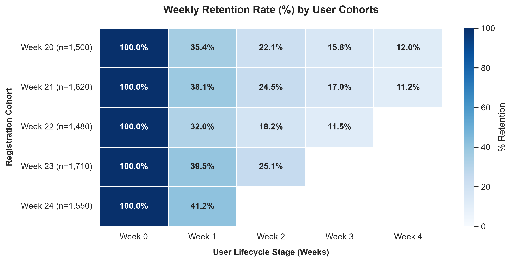

# FitLife Analytics — End‑to‑End Data Analytics Case Study
### SQL • Python • Cohorts • Unit Economics • A/B Testing
This case study analyzes FitLife’s funnel performance, retention behavior, unit economics, and A/B test results to identify growth bottlenecks and quantify the impact of a redesigned Paywall.

## Project Overview
FitLife is a subscription‑based fitness app offering a **7‑day trial** followed by a **$9.99 monthly plan**.
The analysis focuses on:

- Funnel conversion by acquisition channel
- Weekly and monthly retention patterns
- LTV, CAC efficiency, and ROMI
- A/B test of a redesigned Paywall
- Business impact and strategic recommendations

The dataset is synthetic for SQL logic but scaled to FitLife’s real annual traffic of **1,200,000 users**.

## Tools & Metrics
- **SQL (PostgreSQL)** — funnel analysis, weekly retention, monthly cohorts
- **Python (Pandas, Seaborn, Statsmodels)** — cohort visualization, statistical testing

**Key Metrics**:

CR_to_trial • CR_trial_to_paid • Retention • LTV • CAC • ROMI

## Funnel Analysis (SQL)
### SQL Query
```sql
SELECT
    u.source,
    COUNT(DISTINCT u.id) AS total_users,
    COUNT(DISTINCT CASE WHEN a.event_name = 'trial_activated' THEN u.id END) AS trial_users,
    ROUND(
        COUNT(DISTINCT CASE WHEN a.event_name = 'trial_activated' THEN u.id END)::numeric 
        / COUNT(DISTINCT u.id) * 100, 2
    ) AS cr_to_trial,
    COUNT(DISTINCT CASE WHEN t.payment_status = 'completed' THEN u.id END) AS paying_users,
    ROUND(
        COUNT(DISTINCT CASE WHEN t.payment_status = 'completed' THEN u.id END)::numeric 
        / NULLIF(COUNT(DISTINCT CASE WHEN a.event_name = 'trial_activated' THEN u.id END), 0) * 100, 2
    ) AS cr_trial_to_paid
FROM users u
LEFT JOIN activity a ON u.id = a.user_id
LEFT JOIN transactions t ON u.id = t.user_id
GROUP BY u.source
ORDER BY total_users DESC;
```

### Funnel Results


### Key Insights

* **Organic** is the top-performing acquisition channel, leading in trial conversion rate (**13.43%**).
* **Instagram** delivers the highest-quality leads, achieving the top trial-to-paid conversion rate (**15.91%**).
* **TikTok** generated 300 users but showed a **0%** trial-to-paid conversion rate (`cr_trial_to_paid = 0`).

## Retention Analysis (Python)
### Code (key parts)
```python
# Create synthetic absolute user counts per cohort
data = {
    'Cohort': ['Week 20', 'Week 21', 'Week 22', 'Week 23', 'Week 24'],
    'W0': [1500, 1620, 1480, 1710, 1550],
    'W1': [531,  617,  474,  675,  639],
    'W2': [332,  397,  269,  429,  np.nan],
    'W3': [237,  275,  170,  np.nan, np.nan],
    'W4': [180,  181,  np.nan, np.nan, np.nan]
}
cohort_pivot = pd.DataFrame(data).set_index('Cohort')

# Calculate relative Retention Rate (%) relative to Week 0
retention = cohort_pivot.div(cohort_pivot.iloc[:, 0], axis=0) * 100

# Plot weekly retention heatmap using Seaborn
plt.figure(figsize=(10, 6))
sns.heatmap(retention, annot=True, fmt=".1f", cmap="YlGnBu", cbar_kws={'label': '% Retention'})
```

### Retention Heatmap



### Key Insights
- The steepest drop occurs immediately after onboarding, with **Week 1 Retention dropping to ~32–41%** across cohorts (a ~60% user churn in the first 7 days).
- Later cohorts follow nearly identical curves, indicating stable long‑term behavior.
- Retention decays steadily, stabilizing around **11–12% by Week 4**.
- Cohort **Week 22** shows an noticeable retention dip at Week 2 (18.2%), suggesting possible technical issues or poor acquisition traffic during that period. 

## Unit Economics
### Code (key parts)
```python
# LTV assuming 100% Gross Margin (pure marginal revenue per subscriber)
LTV = AOV * lifespan_months

# Unit ROMI based on LTV per acquired customer
romi_pct = ((LTV - CAC) / CAC) * 100
```

### Key metrics

| Metric        | Value        |
|---------------|--------------|
| AOV           | $9.99        |
| Lifespan      | 4.2 months   |
| LTV           | $41.95 (Gross Margin = 100% assumed)      |
| CAC           | $30.0       |
| LTV/CAC       | ≈ 1.4×       |
| ROMI          | +39.8% |

**Note on LTV**: Calculated as AOV * Lifespan * Gross Margin. Gross Margin is assumed to be **100%** (pure marginal revenue per user) for unit economics modeling.

### Key Insights
FitLife cannot scale efficiently without improving conversion or reducing CAC. Retention improvements directly increase LTV and unlock sustainable growth.

## A/B Test — New Paywall Design
### Hypothesis
A redesigned Paywall will increase trial‑to‑paid conversion.

### Results
| Group    | Conversion | Buyers  |
|----------|------------|---------|
| Control  | 1.50%      | 18,000  |
| Variant  | 1.87%      | 22,440  |

- **Uplift**: +24.7%
- **p-value**: 0.00096 (statistically significant)

## Business Impact
Annual traffic: **1,200,000 users**:

| Metric                | Value        |
|-----------------------|--------------|
| Additional buyers     | +4,440       |
| Incremental revenue   | +$186,258    |

### Conclusion
The redesigned Paywall significantly improves conversion and should be rolled out globally.

## Executive Insights
- High‑volume channels deliver weak trial activation, indicating inefficient spend.
- Retention decays sharply after Week 1, indicating onboarding gaps.
- LTV/CAC ≈ 1.4×, indicating limited scalability.
- The new Paywall delivers a 24% uplift in conversion, resulting in approximately $186k in additional annual revenue.

## Recommendations
- Roll out the new Paywall.
- Improve onboarding and early‑week engagement.
- Shift budget away from low‑performing channels.
- Strengthen mid‑lifecycle retention (pushes, challenges, content).

## Repository Structure

```bash
fitlife-analytics/
├── data/
│   ├── users.csv
│   ├── activity.csv
│   └── transactions.csv
│
├── sql/
│   ├── funnel_analysis.sql
│   ├── retention_weekly.sql
│   └── cohort_monthly.sql
│
├── python/
│   ├── retention_heatmap.ipynb
│   ├── ab_test_analysis.ipynb
│   └── unit_economics.ipynb
│
├── visuals/
│   ├── funnel_results.png
│   ├── retention_heatmap.png
│   └── paywall_ab_test.png
│
├── docs/
│   └── README.md
│
└── requirements.txt
```

## Summary
This project demonstrates the full workflow of a product data analyst:

**SQL → Python → Cohorts → Unit Economics → A/B Testing → Business Impact.**
