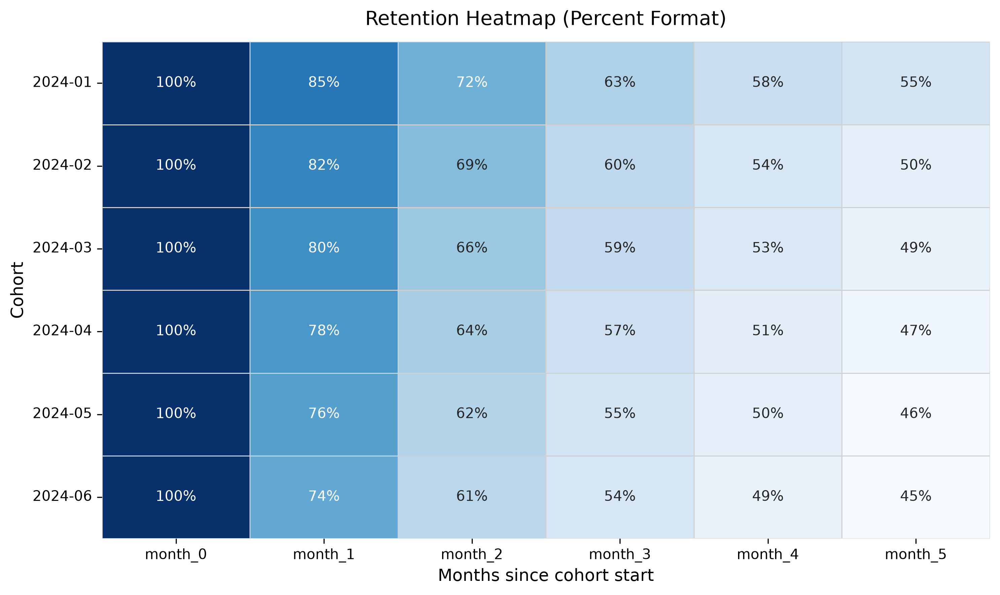

# FitLife Analytics — End‑to‑End Data Analytics Case Study
### SQL • Python • Cohorts • Unit Economics • A/B Testing
This case study analyzes FitLife’s funnel performance, retention behavior, unit economics, and A/B test results to identify growth bottlenecks and quantify the impact of a redesigned Paywall.

## Project Overview
FitLife is a subscription‑based fitness app offering a **7‑day trial** followed by a **$9.99 monthly plan**.
The analysis focuses on:

- Funnel conversion by acquisition channel
- Weekly and monthly retention patterns
- LTV, CAC efficiency, and ROMI
- A/B test of a redesigned Paywall
- Business impact and strategic recommendations

The dataset is synthetic for SQL logic but scaled to FitLife’s real annual traffic of **1,200,000 users**.

## Tools & Metrics
- **SQL (PostgreSQL)** — funnel analysis, weekly retention, monthly cohorts
- **Python (Pandas, Seaborn, Statsmodels)** — cohort visualization, statistical testing

**Key Metrics**:

CR_to_trial • CR_trial_to_paid • Retention • LTV • CAC • ROMI

## Funnel Analysis (SQL)
### SQL Query
```sql
SELECT
    channel,
    COUNT(*) AS users,
    SUM(CASE WHEN trial_start IS NOT NULL THEN 1 END) AS trial_users,
    SUM(CASE WHEN is_paying = TRUE THEN 1 END) AS paying_users,
    ROUND(trial_users * 100.0 / users, 2) AS cr_to_trial,
    ROUND(paying_users * 100.0 / trial_users, 2) AS cr_trial_to_paid
FROM users
GROUP BY channel;
```

### Funnel Results


### Key Insights

- Organic traffic converts perfectly.
- Instagram sends moderate‑quality leads but converts all trial users.
- Facebook delivers **zero** trial activations.

## Retention Analysis (Python)
### Code (key parts)
```python
cohort_pivot = df.groupby(['cohort_month','month_number'])['user_id'].nunique().unstack()
retention = cohort_pivot.div(cohort_pivot.iloc[:,0], axis=0)
sns.heatmap(retention, annot=True, fmt=".0%", cmap="Blues")
```

### Retention Heatmap



### Key Insights
- Largest drop occurs between **Month 0 and Month 1**.
- Later cohorts follow nearly identical curves, indicating stable long‑term behavior.
- Retention stabilizes around **45–55%** by Month 5.

## Unit Economics
### Code (key parts)
```python
LTV = AOV * lifespan_months
ROMI = (LTV - CAC) / CAC
```

### Key metrics

| Metric        | Value        |
|---------------|--------------|
| AOV           | $9.99        |
| Lifespan      | 4.2 months   |
| LTV           | $41.95       |
| CAC           | varies       |
| LTV/CAC       | ≈ 1.4×       |
| ROMI          | negative for several channels |

### Key Insights
FitLife cannot scale efficiently without improving conversion or reducing CAC. Retention improvements directly increase LTV and unlock sustainable growth.

## A/B Test — New Paywall Design
### Hypothesis
A redesigned Paywall will increase trial‑to‑paid conversion.

### Results
| Group    | Conversion | Buyers  |
|----------|------------|---------|
| Control  | 1.50%      | 18,000  |
| Variant  | 1.87%      | 22,440  |

- **Uplift**: +24%
- **p-value**: < 0.05 (statistically significant)

## Business Impact
Annual traffic: **1,200,000 users**:

| Metric                | Value        |
|-----------------------|--------------|
| Additional buyers     | +4,440       |
| Incremental revenue   | +$186,258    |

### Conclusion
The redesigned Paywall significantly improves conversion and should be rolled out globally.

## Executive Insights
- High‑volume channels deliver weak trial activation, indicating inefficient spend.
- Android users convert worse, suggesting UX/Paywall issues.
- Retention decays sharply after Month 1, indicating onboarding gaps.
- LTV/CAC ≈ 1.4×, indicating limited scalability.
- The new Paywall delivers a 24% uplift in conversion, resulting in approximately $186k in additional annual revenue.

## Recommendations
- Roll out the new Paywall.
- Improve onboarding and early‑week engagement.
- Shift budget away from low‑performing channels.
- Strengthen mid‑lifecycle retention (pushes, challenges, content).

## Repository Structure

```bash
fitlife-analytics/
├── data/
│   ├── users.csv
│   ├── activity.csv
│   └── transactions.csv
│
├── sql/
│   ├── funnel_analysis.sql
│   ├── retention_weekly.sql
│   └── cohort_monthly.sql
│
├── python/
│   ├── retention_heatmap.ipynb
│   ├── ab_test_analysis.ipynb
│   └── unit_economics.ipynb
│
├── visuals/
│   ├── funnel_results.png
│   ├── retention_heatmap.png
│   └── paywall_ab_test.png
│
├── docs/
│   └── README.md
│
└── requirements.txt
```

## Summary
This project demonstrates the full workflow of a product data analyst:

**SQL → Python → Cohorts → Unit Economics → A/B Testing → Business Impact.**
